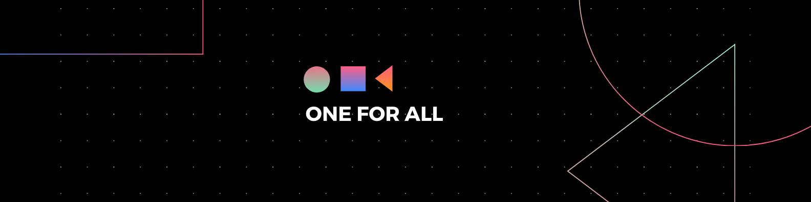

**OFA** es una aplicación web destinada al monitoreo de redes IPv4. Surge para cumplir con las necesidades de un software moderno y efectivo que se aboque en el monitoreo de la red de la empresa cliente, una importante cadena de supermercados del pais. La solucion fue desarrollada como proyecto de fin de carrera para el instituto BIOS.

A continuacion presento una sintesis de la documentacion generada para el proyecto.

 

# Índice

* [Capitulo 1 - Introduccion](#introducción-1)

* [Capitulo 2 - Descripción del negocio y requerimientos](#descripción-del-negocio-y-requerimientos-2)

* [Capitulo 3 - Tecnologías y plataformas](#-tecnologías-y-plataformas-3)

* [Capitulo 4 - Evaluación de riesgos](#evaluación-de-riesgos-4)

* [Capitulo 5 - Casos de uso](#casos-de-uso-5)

* [Capitulo 6 - Planificación](#planificación-6)

* [Capitulo 7 - Modelo conceptual](#modelo-conceptual-7)

* [Capitulo 8 - Análisis y diseño](#análisis-y-diseño-8)

* [Capitulo 9 - Arquitectura y patrones](#arquitectura-y-patrones-9)

* [Capitulo 10 - Cambios, problemas y replanificaciones](#cambios-problemas-y-replanificaciones-10)

* [Capitulo 11 - Investigación](#investigación-11)

* [Capitulo 12 - Testing y pruebas de calidad](#testing-y-pruebas-de-calidad-12)

* [Capitulo 13 - Anexos](#anexos-13)

 

# INTRODUCCIÓN (1)

### 1.1 - Presentación de equipo
El equipo está únicamente conformado por Claudio Tilbe, de nacionalidad uruguaya, desarrollador a cargo de la documentación y codificación de la solución.

### 1.2 - Presentación de cliente
Una cadena de supermercados mayoristas nacional que cuenta con varias sucursales de mayor y menor envergadura a lo largo del país, se pone en posición de cliente, solicitando un sistema a través del cual pueda monitorear toda su red; desde servidores de importancia en su sucursal central hasta pequeños equipos que sean puntos finales de la red.

### 1.3 - Introducción a la idea

Actualmente trabajo en el área de soporte e infraestructura perteneciente al cliente.
Dentro de esta área hay varias tareas y funciones a desempeñar, de entre las mismas destaca el monitoreo de dispositivos de red, esencial a la hora de detectar anomalías en el flujo normal de trabajo. Detectar problemas de conexión en dispositivos a tiempo puede ser la diferencia entre un problema minúsculo o un mal mayor, especialmente si hablamos de servidores o similares.
Con esta premisa y con la idea de brindar un Software que permita monitorear, organizar y alertar al usuario en caso de incidentes surge OFA. Esta aplicación web, por medio de varias funcionalidades, va a permitir el monitoreo de la red, no solo desde la sucursal central hacia el resto de la Red, sino también desde cada respectivo grupo de operadores vinculado una determinada sucursal y/u otras subredes contiguas.
OFA tiene un sistema por el cual identifica el riesgo según el estado y características de un dispositivo, y alerta, notifica o ignora basado en cómo el usuario haya configurado ese determinado dispositivo.
La distribución de usuarios y el hecho de brindar acceso a cada grupo de operadores al monitoreo de su propia sucursal da como ventaja una configuración más precisa del Software, ya que comprenden el contexto, finalidades y funciones de cada dispositivo informático en sus subredes.
También existe la posibilidad de programar tareas, como análisis de una determinada subred y análisis de puertos de un dispositivo señalado, dando así la posibilidad de identificar el estado de cada puerto y que servicio específicamente corre por el mismo. Por otro lado, en OFA estará presente la posibilidad de visualizar una serie de estadísticas por medio de un Dashboard con distintos gráficos que podrán ser de ayuda al usuario. Y para contribuir con este tipo de apartados gráficos también brindará, en otra sección de la aplicación web, una funcionalidad para que el usuario pueda subir y alojar en el servidor el diagrama de red correspondiente a su sucursal, siendo visible luego tanto para él como para cualquier administrador.

Se busca que el funcionario encargado del soporte de un conjunto de dispositivos informáticos tenga una herramienta para poder diagnosticar y analizar un problema dentro de la red lo más rápido posible para poder accionar según lo sea conveniente.
Por otro lado, con OFA se busca también dar la posibilidad a quien administre la infraestructura, de tener una ventana al estado de cada una de las subredes que están siendo organizadas y administradas por cada respectivo grupo de funcionarios.

La finalidad del Software es conseguir agilizar la detección de errores en dispositivos dentro de la red para poder solventarlos y a su vez, ser un software fácil de utilizar y configurar por usuarios no tan avanzados en relación a conocimientos de redes. 

 

# DESCRIPCIÓN DEL NEGOCIO Y REQUERIMIENTOS (2)
### 2.1 – Información sobre el cliente
El software fue desarrollado para una importante cadena de supermercados del país que también cuenta con una serie de depósitos y pequeños locales abocados a otros rubros. En mayor o menor medida cada uno de estos locales cuenta con su respectiva infraestructura informática que será monitoreada a través del software. El mismo se ubicará en un servidor en la sucursal central desde el que podrá ser utilizado en aquellos locales que dispongan de un equipo de operadores. Algunos locales de menor envergadura, que no disponen de un equipo de operadores serán monitoreados desde Central a través de OFA.

Por otra parte, hay equipos de operadores que monitorean más de una subred, ya sea porque la sucursal dispone de más de una subred o porque se les asigna el monitoreo de infraestructura de locales físicamente cercanos.

### 2.2 – Requerimientos funcionales
#### 2.2.1 – Identificación y descripción de actores
**Operador:** Será un funcionario de la empresa vinculado al área de soporte e infraestructura informática. Cumplirá con el rol de monitorear la red y mantener organizados los dispositivos conectados por medio de la aplicación web.

**Administrador:** Será un funcionario de la empresa orientado al área de la infraestructura informática. Cumplirá con el rol de monitorear la red, gestionar los usuarios de la aplicación y podrá utilizar las funcionalidades de análisis de la misma.

**Usuario (Referencia):** Nos haremos de este término para indicar cuando un caso de uso puede tener tanto un operador o un administrador como actor.

#### 2.2.2 – Diagrama de casos de uso

### 2.3 – Requerimientos no funcionales
FURPS+

 

# 🛠 TECNOLOGÍAS Y PLATAFORMAS (3)

**Aclaración:** Se utilizara **.NET 5** como plataforma en común para desarrollar tanto Back-end como Front-end.

### 3.1 – Repositorio de datos
**SQL Server 2019** se utilizará para gestionar la base de datos empleada por el sistema.
La base de datos se creará a través de un script en el cual también se definirán una serie de procedimientos almacenados que serán utilizados por la API Rest.
Por otro lado, la seguridad integrada estará deshabilitada y la seguridad será definida principalmente por un conjunto de usuarios, roles y permisos delimitados por el desarrollador.

### 3.2 – Back-End
**API REST**. Será la interfaz que permitirá la comunicación entre nuestro Back-end y Front-end. En la API Rest se alojan una serie de métodos que podrán ser utilizados por nuestra aplicación web y que cumplen la función de utilizar las operaciones de nuestras capas en el Back-end para lograr el procesamiento y finalmente la resolución de los objetivos del usuario al efectuar los diversos casos de uso.

**ADO.NET** será utilizado en la capa de persistencia para poder acceder a los registros de la base de datos.

**Nmap** es un software de código abierto que será el responsable de procesar las peticiones de rastreo de puertos cuando el usuario así lo solicite mediante un análisis.

### 3.3 – Front-End
**Aplicación web de ASP.NET MVC**. Será el principal componente del Front-end y la tecnología que utilizará nuestro sistema para proveer de un sitio web a nuestros usuarios.

**Bootstrap** será utilizado en la aplicación web para agilizar los tiempos de desarrollo y diseñar una interfaz para el sitio de una manera rápida y efectiva.

**JQuery** será utilizado en el Front-end para facilitar y agilizar la creación de las páginas web que necesiten ser más dinámicas e interactivas; este factor será más recurrente en aquellas paginas que requieren el uso de SignalR.

**SignalR** será el componente destinado a simplificar la adición de funcionalidad web en tiempo real a la aplicación.

**Chart.js** es una librería javascript destinada a la creación de gráficos en base a datos; dicha función tendrá la finalidad de agregar esta librería al Front-End.
ClosedXML es una API C# de código abierto para leer, manipular y escribir documentos de Microsoft Excel 2007+. Será utilizada para generar los documentos excel cuando se solicite la descarga de un listado.

### 3.4 – Tecnologías de soporte
**Postman** es una plataforma que permite y hace más sencilla la creación y el uso de APIs; permitiendo hacer pruebas y comprobar el correcto funcionamiento de las mismas. Será utilizada para validar el funcionamiento de los métodos get, post, put, y delete que expondrá el back-end de nuestra aplicación para que sean consumidas por el front-end.

**Swagger** es un conjunto de herramientas de software de código abierto para diseñar, construir, documentar y utilizar servicios web RESTful. Será utilizada para validar el correcto funcionamiento de los métodos de nuestra API Rest.

 

# EVALUACIÓN DE RIESGOS (4)
### 4.1 – Identificación de Riesgos
#### 4.1.1 – Riesgos del sistema

| Fallo en el Motor  | 
| ------------- | 
| **Descripción**: Falla no controlada en los hilos de trabajo del motor.  | 
| **Probabilidad de Ocurrencia:** Baja | 
| **Impacto en el sistema:** Alto  | 
| **Estrategia de mitigación:** Seguir buenas prácticas de desarrollo y estructurar los algoritmos de manera ordenada. Realizar un testeo intensivo del motor tanto durante la etapa de desarrollo de iteraciones como durante la integración.  | 
| **Plan de contingencia:** Reinicio del Motor por medio de la funcionalidad integrada en el sistema. | 

---

| Ataques al sistema | 
| ------------- | 
| **Descripción**:  Ataques informáticos dirigidos a vulnerar el sistema por parte de cibercriminales. | 
| **Probabilidad de Ocurrencia:** Baja | 
| **Impacto en el sistema:** Alto  | 
| **Estrategia de mitigación:** Estructurar la solución con una seguridad robusta. Investigar posibles vulnerabilidades de las tecnologías utilizadas. Realizar pruebas de Pentesting contra el sistema una vez finalizado.  | 
| **Plan de contingencia:** Analizar el ataque para ubicar puntos débiles en el sistema. Fortalecer y reforzar en materia de seguridad él o los sectores afectados por el ataque. | 

---

| Exceder recursos del servidor | 
| ------------- | 
| **Descripción**:  El sistema exige más potencia en términos de recursos de los que el servidor puede proveer.| 
| **Probabilidad de Ocurrencia:** Baja | 
| **Impacto en el sistema:** Alto  | 
| **Estrategia de mitigación:**  Realizar pruebas al finalizar el desarrollo del sistema en algún equipo para poder brindar una recomendación de base a fundamentos sobre un ajuste óptimo con un hardware definido. Efectuar pruebas luego del deploy para ajustar los recursos que va a consumir a un nivel que no exceda las capacidades del servidor.  | 
| **Plan de contingencia:** Realizar un análisis de consumo de recursos apoyado en herramientas del sistema operativo y/o software externo con licencias de uso gratuito. Disminuir la potencia del sistema y por lo tanto los recursos consumidos por el mismo. En caso de no obtener resultados óptimos consultar la posibilidad de mejorar el hardware del servidor.  | 

---

#### 4.1.2 – Riesgos durante la etapa de desarrollo

| Planificación demasiado optimista | 
| ------------- | 
| **Descripción**:  Superar los límites de tiempo estimados en alguno o varios ciclos de desarrollo.| 
| **Probabilidad de Ocurrencia:** Media | 
| **Impacto en el sistema:** Bajo  | 
| **Estrategia de mitigación:**  Investigación previa y constante sobre tecnologías a utilizar. Llevar un control semanal sobre los ciclos de desarrollo. | 
| **Plan de contingencia:** Rediseñar el ciclo de desarrollo en función de los cambios que se hayan producido, esto incluye suma de carga horaria y/o agregar más ciclos de desarrollo. | 

---

| Falta de experiencia | 
| ------------- | 
| **Descripción**: Falta de experiencia en tecnologías y metodologías utilizadas para el desarrollo del sistema. | 
| **Probabilidad de Ocurrencia:** Alta | 
| **Impacto en el sistema:** Media  | 
| **Estrategia de mitigación:** Capacitación e investigación constante. | 
| **Plan de contingencia:** Revisiones en retrospectiva mensualmente analizando el sistema en busca de mejoras teniendo en cuenta la progresión en términos de conocimiento del desarrollador. |

---

| Investigación insuficiente | 
| ------------- | 
| **Descripción**: Fuentes de información inadecuadas o insuficientes. | 
| **Probabilidad de Ocurrencia:** Media | 
| **Impacto en el sistema:** Medio  | 
| **Estrategia de mitigación:** Reafirmar la veracidad y aplicación de la información extraída de las fuentes comparándolas con otras; extraer información principalmente de fuentes oficiales o de confianza.  | 
| **Plan de contingencia:** Realizar una revisión de la estructura, configuración y/o código escrito realizado en base a fuentes de información poco fiables o inadecuadas. |

---

| Conceptualización de la idea no acertada | 
| ------------- | 
| **Descripción**:  Fallo al conceptualizar la solución con la información proporcionada del cliente. | 
| **Probabilidad de Ocurrencia:** Baja | 
| **Impacto en el sistema:** Medio  | 
| **Estrategia de mitigación:** Grabar audio de reuniones con el cliente para su posterior revisión en caso de ser necesario  (si está de acuerdo). Efectuar revisiones de la documentación generada. | 
| **Plan de contingencia:** Programar nuevas reuniones con el cliente, promover un feed-back constante si es necesario. Planificar anticipadamente las consultas a realizar con el cliente en las reuniones. |

---

| Cambios en los requisitos del cliente | 
| ------------- | 
| **Descripción**: Cambio en las necesidades del cliente que afecten a los requerimientos de la solución. | 
| **Probabilidad de Ocurrencia:** Baja | 
| **Impacto en el sistema:** Medio  | 
| **Estrategia de mitigación:** Establecer una buena comunicación con el cliente. Proporcionar recomendaciones con respecto a la estructura y funcionalidades de la solución. | 
| **Plan de contingencia:** Planificar una nueva reunión y re estructurar las secciones de la solución que sean necesarias. |

# CASOS DE USO (5)
### 5.1 – Casos de uso de alto nivel

| Caso de uso  | Logueo |
| ------------- | ------------- |
| **Actor principal** | Operador, Administrador  |
| **Actor secundario**  |   |
| **Descripcion** | Inicio de sesión con su cuenta asignada. |

---

| Caso de uso  | Deslogueo |
| ------------- | ------------- |
| **Actor principal** | Operador, Administrador  |
| **Actor secundario**  |   |
| **Descripcion** | Cerrar sesión con su cuenta asignada. |

---

| Caso de uso  | Visualizar perfil |
| ------------- | ------------- |
| **Actor principal** | Operador, Administrador  |
| **Actor secundario**  |   |
| **Descripcion** | El Usuario puede visualizar la información de su propio perfil. En caso de ser Administrador podrá visualizar el perfil de otros.|

---

| Caso de uso  | Listado de diagramas de red |
| ------------- | ------------- |
| **Actor principal** | Administrador |
| **Actor secundario**  |   |
| **Descripcion** | Muestra un listado con los diagramas de red subidos por cada usuario.|

---

| Caso de uso  | Listado Sucursales |
| ------------- | ------------- |
| **Actor principal** | Administrador |
| **Actor secundario**  |   |
| **Descripcion** | Muestra una lista de sucursales con la respectiva información de cada una. |

---

| Caso de uso  | Listado Grupos |
| ------------- | ------------- |
| **Actor principal** | Operador, Administrador |
| **Actor secundario**  |   |
| **Descripcion** | El usuario accede a un listado con sus Grupos creados. |

---

| Caso de uso  | Listado Reportes |
| ------------- | ------------- |
| **Actor principal** | Operador, Administrador |
| **Actor secundario**  |   |
| **Descripcion** | Muestra una lista de Reportes con la respectiva información de cada uno. |

---

| Caso de uso  | Visualizar Logs de Motor |
| ------------- | ------------- |
| **Actor principal** | Administrador |
| **Actor secundario**  |   |
| **Descripcion** | Permite visualizar errores no previstos que puedan darse dentro del Motor. |

---

| Caso de uso  | Listado de análisis de puertos  |
| ------------- | ------------- |
| **Actor principal** | Administrador |
| **Actor secundario**  |   |
| **Descripcion** | Muestra una lista de análisis de puertos efectuados y por efectuar con la respectiva información de cada uno. |

---

| Caso de uso  | Visualizar Dashboard  |
| ------------- | ------------- |
| **Actor principal** | Administrador |
| **Actor secundario**  |   |
| **Descripcion** | Muestra un conjunto de estadísticas presentadas como distintos gráficos. |

---

| Caso de uso  | Configurar Mail  |
| ------------- | ------------- |
| **Actor principal** | Operador, Administrador |
| **Actor secundario**  |   |
| **Descripcion** | El usuario podrá configurar el mail desde el que se envían los reportes. |

---

| Caso de uso  | Listado Operadores  |
| ------------- | ------------- |
| **Actor principal** | Administrador |
| **Actor secundario**  |   |
| **Descripcion** | Muestra una lista de Operadores con la respectiva información de cada uno, al seleccionar alguno muestra las subredes a su cargo. |

---

| Caso de uso  | Listado Dispositivos  |
| ------------- | ------------- |
| **Actor principal** | Operador, Administrador |
| **Actor secundario**  |   |
| **Descripcion** | Muestra una lista total de dispositivos a cargo, con su información, una serie de acciones y con filtro por subred, grupo o sucursal. |

---

| Caso de uso  | Listado de análisis de subred   |
| ------------- | ------------- |
| **Actor principal** | Administrador |
| **Actor secundario**  |   |
| **Descripcion** | Muestra una lista de análisis de subred efectuados y por efectuar con la respectiva información de cada uno. |

---

| Caso de uso  | Listar dispositivos por estado  |
| ------------- | ------------- |
| **Actor principal** | Operador, Administrador |
| **Actor secundario**  |   |
| **Descripcion** | El Usuario selecciona en un panel un tipo de estado de Dispositivos para que se le liste.|

---

| Caso de uso  | Iniciar Motor |
| ------------- | ------------- |
| **Actor principal** |  Administrador |
| **Actor secundario**  |   |
| **Descripcion** | Permite iniciar los trabajos realizados por el Motor. |

---

| Caso de uso  | Listado Administradores |
| ------------- | ------------- |
| **Actor principal** |  Administrador |
| **Actor secundario**  |   |
| **Descripcion** | Muestra una lista de Administradores con la respectiva información de cada uno. |

---

| Caso de uso  | Sincronizar sondeo |
| ------------- | ------------- |
| **Actor principal** | Operador, Administrador |
| **Actor secundario**  |   |
| **Descripcion** | Permite el monitoreo de una lista de dispositivos, que pueden ser filtrados por grupo, actualizando sus datos en tiempo real. |

---

| Caso de uso  | Detener Sondeo |
| ------------- | ------------- |
| **Actor principal** | Operador, Administrador |
| **Actor secundario**  |   |
| **Descripcion** | Deja de actualizar las funciones de monitoreo en pantalla con datos en tiempo real. |

---

| Caso de uso  | Exportar listado de Dispositivos |
| ------------- | ------------- |
| **Actor principal** | Operador, Administrador |
| **Actor secundario**  |   |
| **Descripcion** | Permite exportar en formato xlsx (Excel) un listado de dispositivos seleccionados. |

---

| Caso de uso  | Gestión de sucursal |
| ------------- | ------------- |
| **Actor principal** | Administrador |
| **Actor secundario**  |   |
| **Descripcion** | Permite el alta, baja y modificación de una sucursal mediante su selección en lista o su búsqueda.|

---

| Caso de uso  | Gestión de diagrama de red |
| ------------- | ------------- |
| **Actor principal** | Operador, Administrador |
| **Actor secundario**  |   |
| **Descripcion** | Permite subir un diagrama de red visible para si mismo y los administradores. También permite eliminarlo. |

---

| Caso de uso  | Gestión de Grupo |
| ------------- | ------------- |
| **Actor principal** | Operador, Administrador |
| **Actor secundario**  |   |
| **Descripcion** | Permite el alta, baja y modificación de un Grupo mediante su selección en lista o su búsqueda. |

---

| Caso de uso  | Detener Motor |
| ------------- | ------------- |
| **Actor principal** | Administrador |
| **Actor secundario**  |   |
| **Descripcion** | Permite detener los trabajos realizados por el Motor. |

---

| Caso de uso  | Gestión de Reporte |
| ------------- | ------------- |
| **Actor principal** | Operador, Administrador |
| **Actor secundario**  |   |
| **Descripcion** | Permite el alta, baja y modificación de un Reporte mediante su selección en lista o selección de dispositivo para Generar. | 

---

| Caso de uso  | Gestión de análisis de puertos |
| ------------- | ------------- |
| **Actor principal** | Administrador |
| **Actor secundario**  |   |
| **Descripcion** | El Administrador puede programar como tarea un análisis de puertos de un dispositivo conocido. | 

---

| Caso de uso  | Gestión de análisis de subred  |
| ------------- | ------------- |
| **Actor principal** | Administrador |
| **Actor secundario**  |   |
| **Descripcion** | El Administrador puede programar como tarea un análisis indicando una subred. | 

---

| Caso de uso  | Gestión de Dispositivo  |
| ------------- | ------------- |
| **Actor principal** | Operador,  Administrador |
| **Actor secundario**  |   |
| **Descripcion** | Permite el alta, baja y modificación de un dispositivo mediante su selección en lista o su búsqueda. | 

---

| Caso de uso  | Gestión de Operador |
| ------------- | ------------- |
| **Actor principal** | Administrador |
| **Actor secundario**  |   |
| **Descripcion** | Permite el alta, baja y modificación de un Operador mediante su selección en lista o su búsqueda. | 

---

| Caso de uso  | Gestión de Administrador |
| ------------- | ------------- |
| **Actor principal** | Administrador |
| **Actor secundario**  |   |
| **Descripcion** | Permite el alta, baja y modificación de un Administrador mediante su selección en lista o su búsqueda. | 

 

# PLANIFICACIÓN (6)
### 6.1 – Clasificación y ponderación de casos de uso
#### 6.1.1 – Criterios
Importancia para el cliente: Cuantificara lo importante que es el caso de uso para el cliente.
Criticidad para el negocio: Cuantificara que tan crítico es el caso de uso para que el negocio funcione con normalidad.
Impacto en la arquitectura: Cuantificara que tan grande fue el cambio en la arquitectura para poder implementar el caso de uso de manera correcta.
Importancia para el sistema: Cuantificara que tan importante es el caso de uso dentro del flujo normal de trabajo con el sistema e indicará si el caso de uso es imprescindible o una funcionalidad extra.
Dificultad de implementación: Cuantificara la cantidad de carga horaria que se provee destinar a la investigación e implementación de la funcionalidad utilizada por el caso de uso.

#### 6.1.2 – Priorización cuantitativa

#### 6.1.3 – Rangos para definir niveles de importancia
- **Alta:** Desde 100 hasta 68.
- **Media:** Desde 67 hasta 42.
- **Baja:** Desde 41 hasta 0.  

### 6.2 – Asignación a ciclos de desarrollo

### 6.3 – GANTT 

- **Planificado**

- **Ejecutado**

 

# Modelo Conceptual (7)

### 7.1 – Diagrama Entidad-Relación 
#### 7.1.1 – DER

#### 7.1.2 – Pasaje a Tablas

- **Mail** ( <ins>Correo</ins>, Contraseña, HostServidor, Puerto)
- **Usuario** ( <ins>UsuarioID</ins>, Contraseña, Correo)
- **Administrador** ( <ins>UsuarioID</ins>, Nombre, NumeroFuncionario, Cargo)
- **Operador** ( <ins>UsuarioID</ins>, NumeroFuncionarioSupervisor, NombreSupervisor)
- **Sucursal** ( <ins>NumeroSucursal</ins>, Tipo, Departamento, Calle, NumeroLocal)
- **SucursalXOperador** ( <ins>UsuarioID, NumeroSucursal</ins>)
- **Subred** ( <ins>Rango</ins>, NumeroSucursal)
- **Dispositivo** ( <ins>IP</ins>, Nombre, Tipo, Conectado, Accesible, Sector, Prioridad, Permanencia, UltimaConexion, UltimaNotificacion, NumeroSucursal)
- **Grupo** ( <ins>Codigo</ins>, NombreGrupo, Descripcion, UsuarioID)
- **DispositivoEnGrupo** ( <ins>CodigoGrupo, DispositivoIP</ins>)
- **Reporte** ( <ins>Codigo</ins>, Correo, DispositivoIP, Asunto, Destino, Mensaje) 
- **MensajeVisor** ( <ins>Id</ins>, DispositivoIP, FechaGenerado, Contenido, UsuarioID)
- **EstadoMotor** ( <ins>IDEstado</ins>, Activo, UltimaModificacion, UsuarioReg)
- **AnalisisRed** ( <ins>IdAnalisis</ins>, RangoSubred, Razon, Estado, Prioridad, NuevosDispositivos, FechaGenerado, FechaFinalizado, UsuarioID)
- **EscaneoPuertos** ( <ins>IdEscaneo</ins>, DispotitivoIP, Razon, Estado, Prioridad, CadenaSalida, FechaGenerado, FechaFinalizado, UsuarioID)
- **DiagramaRed** ( <ins>NumeroSucursal</ins>, Nombre, FechaSubida, DiagramaImagen)
- **MensajeAPI** ( <ins>IDMensaje</ins>, Excepcion, Mensaje, MetodoOrigen, FechaGenerado, Tipo)

#### 7.1.3 – RNE

- **Tabla MAIL:**
Correo: Debe contener "@" y ".com"
Puerto: Debe estar entre 0 y 65536

- **Tabla ADMINISTRADOR:**
NumeroFuncionario: Mayor a 0 y menor a 10000000

- **Tabla OPERADOR:**
NumeroFuncionarioSupervisor: Mayor a 0 y menos a 100000000

- **Tabla SUCURSAL:**
NumeroSucursal: Menor a 10000 y mayor a 0
NumeroLocal: Mayor a 0 y menor a 100000000

- **Tabla DISPOSITIVO:**
IP: Tiene la estructura X.X.X.X; siendo X distintos números entre 1 y 255
Prioridad: Puede ser alta, media o baja
UltimaConexion: No puede tener fecha y hora por delante del presente
UltimaNotificacion: No puede tener fecha y hora por delante del presente

- **Tabla GRUPO:**
Codigo: Identity (1, 1)

- **Tabla REPORTE:**
Codigo : Identity (1, 1)
Destino:  Debe contener "@" y ".com"

- **Tabla MENSAJEVISOR:**
Id: Identity (1, 1)
FechaGenerado: No puede tener fecha y hora por delante del presente

- **Tabla ESTADOMOTOR:**
IDEstado: Identity (1, 1)
UltimaModificacion: No puede tener fecha y hora por delante del presente

- **Tabla ANALISISRED:**
IdAnalisis: Identity (1, 1)
Subred: Tiene la estructura X.X.X; siendo X distintos números entre 1 y 255
Estado: Puede estar en pendiente, cancelado, finalizado
Prioridad: Puede ser baja, media o alta
NuevosDispositivos: Debe ser mayor o igual a 0
FechaGenerado: No puede tener fecha y hora por delante del Presente
FechaFinalizado: No puede tener fecha y hora por delante del Presente

- **Tabla ESCANEOPUERTOS:**
IdEscaneo: Identity (1, 1)
Estado: Puede estar en pendiente, ejecutandose, cancelado, finalizado
Prioridad: Puede ser baja, media o alta
FechaGenerado: No puede tener fecha y hora por delante del Presente
FechaFinalizado: No puede tener fecha y hora por delante del Presente

- **Tabla DIAGRAMARED:**
FechaSubida: No puede tener fecha y hora por delante del Presente
DiagramaImagen: Formato Imagen

- **Tabla MENSAJEAPI:**
IDMensaje: Identity (1, 1)
FechaGenerado: No puede tener fecha y hora por delante del Presente
Tipo: Puede ser "informativo", "advertencia", "critico" o "no identificado"

### 7.2 – Modelo Conceptual

 

# Análisis y Diseño (8)

### 8.1 – Expansión completa por caso de uso
#### 8.1.1 – Diagramas y tablas

***Aclaraciones:***
- _Para facilitar el desarrollo de los casos de uso tomamos por convención que en aquellos momentos que se utilice “Usuario” estamos haciendo referencia a un administrador u operador._
- _Se confeccionaron diagramas de comunicación para gestión de operador, gestión de análisis de subred y ~~ajustar potencia Motor~~_

Los diagramas y/o tablas a continuación seguirán el siguiente formato:
- Caso de uso Expandido
- Diagrama de secuencia del sistema
- Contrato de software
- Diagrama de comunicación (en los casos seleccionados)

**(Pendiente. Dandole formato...)** 💬

 

# ARQUITECTURA Y PATRONES (9)

### 9.1 – SAD
#### 9.1.1 – Vista del modelo de casos de uso
**9.1.1.1 – Diagrama de casos de uso relevantes de la arquitectura**

**9.1.1.1** – Justificacion de los casos de uso relevantes
- **Logueo.** Es relevante porque es el caso de uso a través del cual un usuario anónimo se identifica, o no, con credenciales ya registradas en el sistema. Luego de iniciar sesión pasará a ser un usuario con acceso a las funciones que corresponda según su tipo de usuario. Este caso de uso es fundamental ya que es el que valida que el usuario anónimo o desconocido pueda ingresar a funciones del sistema.

- **Deslogueo.** Es relevante porque a través de este caso de uso el usuario previamente autenticado que inicio sesión, podrá cerrarla, y por lo tanto también cerrar el acceso a las funciones del sistema. Este caso de uso es importante para mermar el riesgo lo máximo posible y evitar situaciones desfavorables para la seguridad del sistema y/o el usuario.

- **Gestión de diagrama de red.** Es relevante porque permite la alta y baja de los diagramas de red de cada sucursal, así como también visualizarlos en detalle.

- **Gestión de análisis de subred.** Es relevante porque permite el alta de nuevos análisis de red, así como también la eliminación, cancelación y visualización en detalle de análisis previamente registrados. A partir del registro de un nuevo análisis el back-end del sistema podrá utilizar los datos en el mismo para efectuar el análisis que corresponda y haya sido solicitado por el administrador.

- **Configurar mail.** Es relevante porque permite la configuración del mail, que será vital a la hora de que el back-end envíe los correos pertinentes según los reportes que hayan sido configurados por el usuario en cuestión. 

- **Gestión de análisis de puertos.** Es relevante porque permite el alta de nuevos escaneos de puertos, así como también la eliminación, cancelación y visualización en detalle de análisis previamente registrados. A partir del registro de un nuevo análisis de puertos el back-end del sistema podrá utilizar los datos en el mismo para efectuar el análisis que corresponda y haya sido solicitado por el administrador.

- **Gestión de grupo.** Es relevante porque este caso de uso posee las funcionalidades, en cuanto a grupos, de alta, baja, modificar y visualizar en detalle; que a su vez son importantes para la manipulación de una entidad destinada a agrupar dispositivos y presentar una vista sobre dispositivos más específicos que se desean monitorear. 

- **Gestión de dispositivo.** Es relevante porque es el caso de uso que permite gestionar los dispositivos a través del alta, baja, modificar y visualizar en detalle. Siendo los dispositivos una de las entidades principales, que abarca gran cantidad de casos de uso, es pertinente que disponga de herramientas que permitan una manipulación y gestión total sobre la entidad.

- **Gestión de reporte.** Es relevante ya que gestiona por medio de alta, baja, modificar y visualizar en detalle, los reportes. Por medio de esta entidad el sistema puede identificar para qué dispositivos tiene que enviar un mail notificando sobre su estado.

- **Iniciar Motor.** Es relevante porque permite iniciar el motor del sistema, que se encarga del sondeo de dispositivos, de ejecutar los análisis de red, ejecutar los escaneos de puertos y enviar los correos según las configuraciones de reportes que haya registrado.

- **Visualizar Logs Motor.** Es relevante ya que permite visualizar a los administradores aquellos errores que hayan ocurrido durante procesos en el motor que hayan provocado algún error.

- **Gestión de sucursales.** Es relevante ya que permite el alta, baja, modificar y visualizar en detalle de sucursales; entidad destinada a ser un punto de referencia geográfico y de ubicación de dispositivos.

- **Gestión de administrador.** Es relevante porque permite el alta, baja, modificar y visualizar en detalle de administradores. Los administradores son tipos de usuarios que se abocan en la completa administración, tanto de la red por medio del sistema, como de los distintos usuarios que pueden y podrán tener acceso en un futuro al sistema desde las varias sucursales existentes.

- **Gestión de operador.** Es relevante porque permite el alta, baja, modificar y visualizar en detalle de operadores. Los operadores son tipos de usuarios que se dedican al monitoreo y revisión de una o varias de las subredes existentes.

- **Detener Motor.** Es fundamental tener la posibilidad de detener los procesos del motor para frenar el consumo de recursos del servidor en situaciones puntuales, para tener un metodo de reinicio del motor, y para poder, en caso de que se estén ocasionando errores, solventar los mismos antes de un nuevo inicio.

#### 9.1.2 – Vista de modelo de diseño
**9.1.2.1 – Descomposicion en sub-sistemas**

**9.1.2.2 – Trazabilidad desde el modelo de casos de uso al modelo de diseño**
- [Trazabilidad Gestión de operador](https://github.com/ClaudioTilbe/oneforall/blob/cacc3f793eb302fe0b5c6cc8afb2a02286fca978/Diagrams/Capitulo%209/Trazabilidad%20Gesti%C3%B3n%20de%20operador.png)
- ~~Trazabilidad Ajustar Potencia Motor~~
- [Trazabilidad Gestión de análisis de subred](https://github.com/ClaudioTilbe/oneforall/blob/cacc3f793eb302fe0b5c6cc8afb2a02286fca978/Diagrams/Capitulo%209/Trazabilidad%20Gesti%C3%B3n%20de%20an%C3%A1lisis%20de%20subred.png)

**9.1.3 – Vista de modelo de implementación**

**9.1.4 – Vista de modelo de distribución**

### 9.2 – Patrones de diseño

En el desarrollo de nuestro software, hemos aplicado cuidadosamente patrones de diseño para mejorar su estructura y eficiencia. A continuación, presentamos los patrones que seleccionamos y las razones detrás de cada elección.

**Patrón Fabrica**
Hemos incorporado el patrón Factory en la capa de backend. Optamos por el patrón Factory para proporcionar una capa de abstracción entre la API Rest y la capa de lógica del backend. Esto garantiza la seguridad y la eficiencia en la gestión de solicitudes, al tiempo que mantiene la lógica del sistema encapsulada, sin exponer detalles concretos a la API REST.

**Patron Singleton**
En nuestro proyecto, hemos seleccionado el patrón Singleton por su capacidad para controlar la creación de instancias de clases de manera precisa. El patrón Singleton asegura que una clase tenga una única instancia y se encarga de crearla solo cuando sea necesario, evitando el desperdicio de recursos. Esto simplifica la gestión y garantiza que cada clase Singleton sea accesible de manera uniforme en toda la aplicación, proporcionando un control efectivo sobre sus estados y operaciones.
Singleton será mayormente utilizado en el backend del sistema por sus características, así como también en el “Hub”, clase que tendrá los métodos referentes a SignalR del lado del servidor.

 

# CAMBIOS, PROBLEMAS Y REPLANIFICACIONES (10)

### 10.1 – Cambios realizados 

***En este capitulo solo se indican los cambios realizados, con la finalidad de marcar el porque de algunos apartados "tachados". Este capitulo se extiende con el fundamento detras de cada cambio en el documento de entrega pero no aporta nada a fines practicos en este repositorio.*** 💬

- Retiro de caso de uso “Ajustar potencia Motor"
- Retiro del valor “ejecutándose” de estado de analisis de red
- Retiro de relación entre análisis de red y subred
- Retiro de relación entre estado motor y administrador

  

# INVESTIGACIÓN (11)

### 11.1 – Fuentes de busqueda e informacion
Para la investigación de las distintas tecnologías y algoritmos que componen la solución opte por utilizar varias fuentes y métodos de búsqueda; Inicialmente probando con las fuentes clásicas hasta llegar a algunas más modernas y/o específicas dependiendo del resultado buscado.

**Google**
La primera instancia para cualquiera de las búsquedas fue google. A partir de aquí pude identificar foros, fuentes oficiales de documentación, repositorios, entre otros. La mayoría de las búsquedas se comenzaron a realizar en inglés en el momento que note la enorme diferencia de resultados y de información extra que podía alcanzar.

**Fuentes oficiales**
Las fuentes oficiales de cada tecnología utilizada y cada tecnología evaluada durante la etapa de planificación, fueron vitales para confeccionar y codificar de manera correcta y con buenas prácticas la solución; además de ser también en parte grandes repositorios con código de ejemplo que en muchos casos fue sumamente útil.

**BIOS**
Los proyectos generados a lo largo de la carrera fueron fundamentales para el desarrollo del sistema, actuando como grandes repositorios de código y como fuente de información a través de las transparencias.

**Foros**
Algunos foros de confianza previa y descubiertos durante los distintos procesos del proyecto también fueron útiles para solucionar problemas eventuales y puntuales, permitiendo llegar a varias soluciones que además eran discutidas por los distintos usuarios del foro para determinar su eficacia y calidad.

**Repositorios**
Más allá de algunas fuentes oficiales que a su vez tenían gran parte de repositorio, se utilizaron páginas puntuales que están definidas como tal y contenían soluciones con fragmentos de código útiles para mi proyecto.

**Inteligencia artificial**
Partiendo inicialmente como una prueba finalmente  se convirtió en una herramienta potente para consultas muy específicas, en las que el contexto era enorme y las palabras clave eran demasiadas para una búsqueda convencional. Fue principalmente utilizada cuando todas las fuentes anteriores fallaban y su información corroborada antes de ser utilizada debido a su poca fiabilidad.

### 11.2 – Aprendizaje de tecnologías
En este apartado se indicará la documentación con la que se abordaron principalmente las tecnologías o conceptos que eran desconocidos hasta antes de comenzar con el desarrollo del software.

- Bootstrap 
Fuente oficial:  
https://getbootstrap.com/docs/4.0/getting-started/introduction/

- Chart.js 
Fuente oficial:  
https://www.chartjs.org/docs/latest/samples/information.html 

- SignalR   
Fuente oficial: 
https://learn.microsoft.com/en-us/aspnet/signalr/overview/older-versions/tutorial-getting-started-with-signalr  
Realice el siguiente curso para capacitarme en esta tecnología:  
https://www.udemy.com/course/aplicaciones-web-en-tiempo-real-con-aspnet-signalr/?couponCode=KEEPLEARNING 

- JQuery  
Fuente oficial: https://api.jquery.com/  
Otras fuentes: https://www.w3schools.com/jquery/default.asp 
 
- API Rest  
Fuente oficial:  
https://learn.microsoft.com/es-es/aspnet/core/web-api/?view=aspnetcore-5.0&WT.mc_id=dotnet-35129-website   
Uso de Swagger:  
https://learn.microsoft.com/es-es/aspnet/core/tutorials/web-api-help-pages-using-swagger?view=aspnetcore-5.0  
Otras fuentes:  
https://www.c-sharpcorner.com/article/asp-net-core-5-0-web-api/ 

### 11.3 – Problemáticas y resolución
En este apartado se indicará la documentación con la que se abordaron problemas puntuales que fueron surgiendo a lo largo del desarrollo de la solución; algunos artículos son parcialmente útiles al desarrollo de la misma por lo que se extrae únicamente la información necesaria.

- Problema 1 - Uso de Nmap a través de código C#
La alternativa más favorable resultó ser ejecutar el software nmap a través de código C# como consola y obtener el output. Para esto se utilizó principalmente la clase Process.
Fuente oficial: https://learn.microsoft.com/es-es/dotnet/api/system.diagnostics.process?view=net-5.0 

- Problema 2 - Manejo de Session en arquitectura MVC  
https://learn.microsoft.com/en-us/aspnet/core/fundamentals/app-state?view=aspnetcore-5.0  
https://stackoverflow.com/questions/55220812/how-to-store-and-retrieve-objects-in-session-state-in-asp-net-core-2-x 

- Problema 3 - Envío de correo a través de código C#
La manera más sencilla y efectiva que encontré investigando es agregando un using. 
https://www.kyocode.com/2019/08/como-enviar-correo-con-c/ 

- Problema 4 - Almacenamiento de imágenes en SQL Server
Idea de utilizar “VARBINARY(MAX)” como medio de almacenamiento de imágenes: 
https://es.stackoverflow.com/questions/259400/convertir-a-byte-una-imagen-para-guardarla-en-sql-server-desde-c
Conversión de “IFormFile” desde la view a un array “byte[]” a almacenar en el objeto: 
https://stackoverflow.com/questions/36432028/how-to-convert-a-file-into-byte-array-in-memory

- Problema 5 - Consumo de métodos de API Rest (get, post, put y delete) 
https://www.tutorialsteacher.com/webapi/consume-web-api-for-crud-operation 

- Problema 6 - Chequeo de conexión de dispositivos 
https://learn.microsoft.com/es-es/dotnet/api/system.net.networkinformation.ping?view=net-5.0 
https://stackoverflow.com/questions/11800958/using-ping-in-c-sharp 
https://www.c-sharpcorner.com/UploadFile/167ad2/how-to-use-ping-in-C-Sharp/

- Problema 7 - Uso de Thread en C# 
https://learn.microsoft.com/en-us/dotnet/api/system.threading.thread?view=net-5.0 

- Problema 8 - Generación dinámica y uso de múltiples Task 
https://learn.microsoft.com/en-us/dotnet/api/system.threading.tasks.task?view=net-5.0 
https://dotnettutorials.net/lesson/how-to-execute-multiple-tasks-in-csharp/

- Problema 9 - Comunicación de variables entre procesos del motor con ConcurrentDictionary 
https://learn.microsoft.com/en-us/dotnet/api/system.collections.concurrent.concurrentdictionary-2?view=net-5.0 

- Problema 10 - Utilización de JWT Token para autenticar usuarios en API Rest 
https://www.c-sharpcorner.com/article/jwt-json-web-token-authentication-in-asp-net-core/  
https://www.c-sharpcorner.com/article/jwt-validation-and-authorization-in-net-5-0/ 

- Problema 11 - Ordenar listados por IP
Algo que parecía sencillo ordenar con Linq finalmente no lo fue tanto y tuve que recurrir a la búsqueda de otra solución. 
https://stackoverflow.com/questions/4785218/linq-lambda-orderby-delegate-for-liststring-of-ip-addresses 

### 11.3 – Discusiones

> [!IMPORTANT]
> Apartado resumido.

#### Discusión 1 - Cómo realizar el escaneo de puertos

- **Alternativas:** 
    - [ ] Verificación de puertos con TcpClient
    - [x] Escaneo en Nmap por medio de clase Process
            
**Principales fuentes revisadas:**  
https://stackoverflow.com/questions/52569696/c-sharp-port-scanner 
https://github.com/thomdixon/SaltwaterTaffy 
https://learn.microsoft.com/en-us/dotnet/api/system.net.sockets.tcpclient?view=net-5.0 

---

#### Discusión 2 - Consumo de API Rest, formato de respuesta
  
- **Alternativas:** 
    - [ ] Respuesta en XML
    - [x] Respuesta en JSON
   
**Principales fuentes revisadas:**  
https://restfulapi.net/json-vs-xml/  
https://www.geeksforgeeks.org/difference-between-json-and-xml/  
https://stackoverflow.com/questions/4862310/json-and-xml-comparison  
https://stackoverflow.com/questions/16293791/which-is-more-secured-and-why-json-or-xml  

---

#### Discusión 3 - Diseño del sitio web

- **Alternativas:**
    - [ ] CSS puro
    - [x] Bootstrap
    - [ ] Tailwind

**Principales fuentes revisadas:**  
https://www.krishaweb.com/blog/tailwind-css-vs-bootstrap/#:~:text=Tailwind%20CSS%20is%20highly%20flexible,range%20of%20pre%2Ddesigned%20components.  
https://chat.openai.com/share/de259d76-58bd-48df-8f15-34937cad7e0c 

#### Discusión 4 - Donde almacenar información de usuario autenticado en el sitio
- **Alternativas:** 
    - [ ] Cookies
    - [x] Session

**Principales fuentes revisadas:**  
https://www.geeksforgeeks.org/difference-between-session-and-cookies/   
https://stackoverflow.com/questions/32563236/relation-between-sessions-and-cookies 

 

# TESTING Y PRUEBAS DE CALIDAD (12)

### 12.1 – Pruebas funcionales de casos de uso
Para realizar las pruebas funcionales sobre los casos de uso opte por el modelo iterativo e incremental, debido a que era el modelo que mejor se adapta a las características del proyecto. 
Ya comenzando con el desarrollo de la solución, a medida que iba avanzando en los ciclos de desarrollo, se fueron testeando mediante pruebas unitarias los distintos componentes que iba codificando. Previo a comenzar con el testing pude identificar que seguramente los puntos con mayor probabilidad de fallo, y mayor dificultad de testeo, se iban a encontrar en el traslado de datos entre los tres grandes bloques: base de datos, back-end y  sitio web; teniendo en cuenta esto me vali de las diversas tecnologías y/o herramientas que pude encontrar más favorables para realizar el testing dentro de cada bloque y en sus conexiones, partiendo también de una manera ordenada desde la base de datos hasta llegar al sitio web.

- **Base de datos.** En este sector se realizaron las pruebas necesarias para corroborar que las verificaciones en cada campo se esten cumpliendo correctamente mediante las inserciones de datos. Por otra parte, también se testean con datos de prueba los distintos procedimientos almacenados para ver su correcto funcionamiento.

- **Back-end.** En los casos que fue necesario, por medio de la depuración, realice un seguimiento de los distintos datos y/o parámetros en líneas puntuales, marcadas con puntos de interrupción. Por otra parte generé una consola de prueba para accionar estas operaciones en mi back-end y verificar que los métodos se efectúen de manera correcta hasta al menos ese punto.

- **Motor.** En el caso del motor nuevamente utilicé la depuración para la detección de errores y el mismo fue modificando su estructura hasta encontrar la más favorable dentro de mis posibilidades. Una vez ya divididas las funciones que el motor tenía que cumplir en varios hilos distintos de trabajo, pude ir analizando mediante la depuración cada proceso para que realice su ciclo de manera correcta; una vez analizados todos los procesos individualmente se volvieron a probar, esta vez efectuando todos al mismo tiempo mediante el encendido del motor.

- **API Rest.** Para realizar el testeo de mi API Rest opté por habilitar Swagger, inicialmente sin haber agregado aún el código necesario para el funcionamiento de los Tokens, de manera que pueda garantizar que las operaciones funcionen correctamente hasta este punto sin verse modificadas por problemas ajenos. 

- **Consumo de API Rest.** Para realizar el testeo sobre el consumo de las operaciones de mi API Rest desde mi sitio web, utilice la herramienta postman. Por medio de esta herramienta pude verificar que mis operaciones por medio de los métodos get, post, put y delete, se pudiesen consumir de manera correcta. 

- **Sitio web.** Para localizar los errores en los distintos sectores de mi sitio web, entiéndase controladores, modelo, e inclusive views, pude utilizar nuevamente la depuración, esta vez de mi sitio web y teniendo ya la API Rest publicada.

- **Front-end.** En los sectores que tenia codigo javascript, me serví del “debugger” para detectar las líneas de código con fallos así como la consola y el inspector, que por otra parte también me sirvió para encontrar fallos HTML y CSS que provocan problemas en mi interfaz gráfica. 

Finalmente, una vez utilizadas estas herramientas para detectar los fallos en los distintos puntos de la solución, resto realizar testing de integración publicando todos los componentes, aún en un ambiente de prueba, para poder comprobar que cada uno de ellos interactúe de manera correcta  con el resto. 

 

# ANEXOS (13)

### 13.1 – Manual de usuario

- [Manual de administrador](https://github.com/ClaudioTilbe/oneforall/blob/810145ea19336edb2b33b0aae93a496a316dd863/Manual%20de%20usuario/Manual%20de%20administrador%20(Version%2097-2003).doc)
- [Manual de operador](https://github.com/ClaudioTilbe/oneforall/blob/810145ea19336edb2b33b0aae93a496a316dd863/Manual%20de%20usuario/Manual%20de%20operador%20(Version%2097-2003).doc)

 

